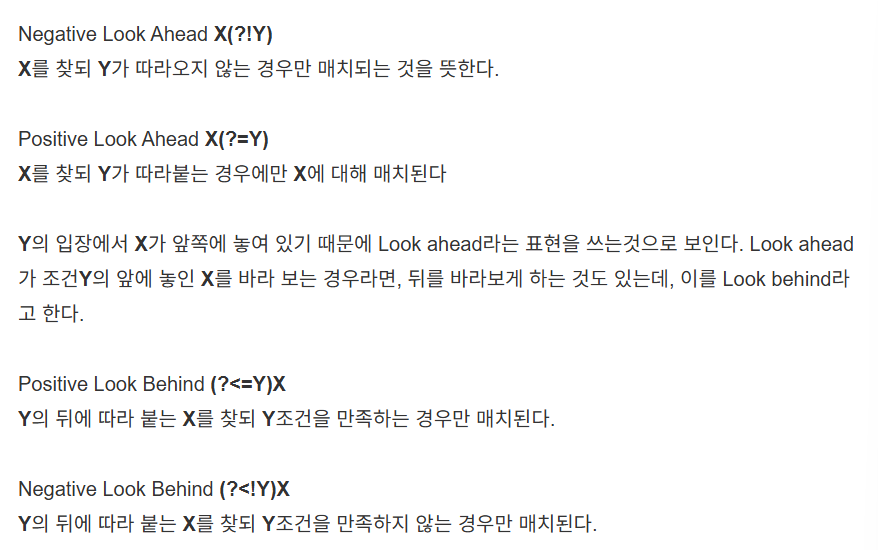

## 코딩 테스트 시 참고사항

1. Priority Queue는 최소 힙이 기본이다. 최대 힙으로 하려면 comparator를 통해 바꿔주자
```java
PriorityQueue<Integer> pq = new PriorityQueue<>(Comparator.reverseOrder());
```

2. 정규식 lookAround -> grouping split을 할 때 유용



3. 정규식 캡처그룹
```java
() : 캡처
\1, \2 : 캡처 그룹 사용

tip : 같은거 묶을 때 : "(?<=(something))(?!\1)" -> 일련의 something으로 묶임
```

4. stream에서 인덱스도 필요하면 Intstream을 쓰자
```java
int[] arr = {10, 20, 30, 40};

IntStream.range(0, arr.length)
    .forEach(i -> {
        System.out.println("Index: " + i + ", Value: " + arr[i]);
    });

```

5. pq는 순회가능하다. 단, 정렬된 순서로 순회하지는 않는다.